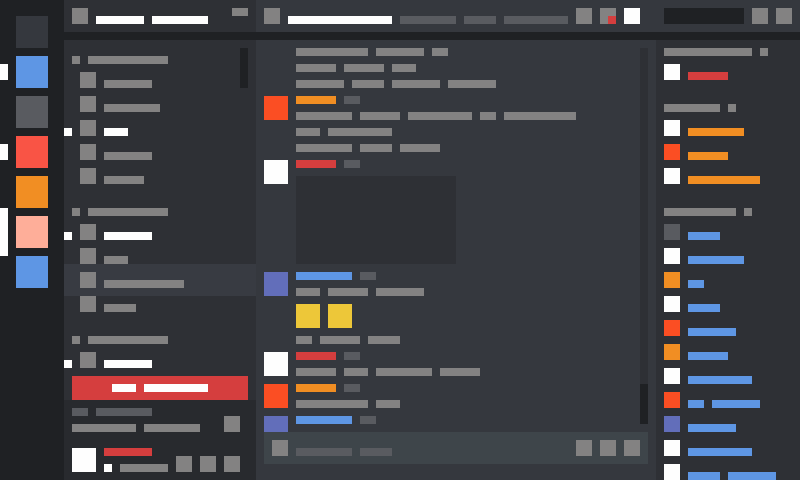

# Discord-Dashboard

Welcome to the Discord-Dashboard repository! This repository was made with the intention of replicating a similar layout and website structure to the discord on the web.

Made using vanilla:

- HTML
- CSS
- A little Javascript

# About

I chose discord as a target of replication as it seemed quite complex at first glance but feasible with vanilla HTML, CSS and Javascript. They also have chrome dev tools disabled so without more research I am unable to just copy the code from the site itself, training my ability to replicate a design just from seeing it.

An idea of the general layout:

Note that this image was not used as the basis for the website, how the website appears on my personal discord account was used so there maybe some discrepancies.

# Features

- UI elements that do not have much functionality
- The Icons on the side bar expand when hovered over just like the real thimg
- Partially responsive - When screen size is reduced part of the nav bar slides behind the other part

# Contributions

1. Start by forking the repository
2. Create a new branch in the forked repository
3. Make any changes you wish
4. Commit and push alterations to the main branch of the forked repository
5. Create a pull request here to get your changes implemented

# License

This project is licensed under the MIT License.
